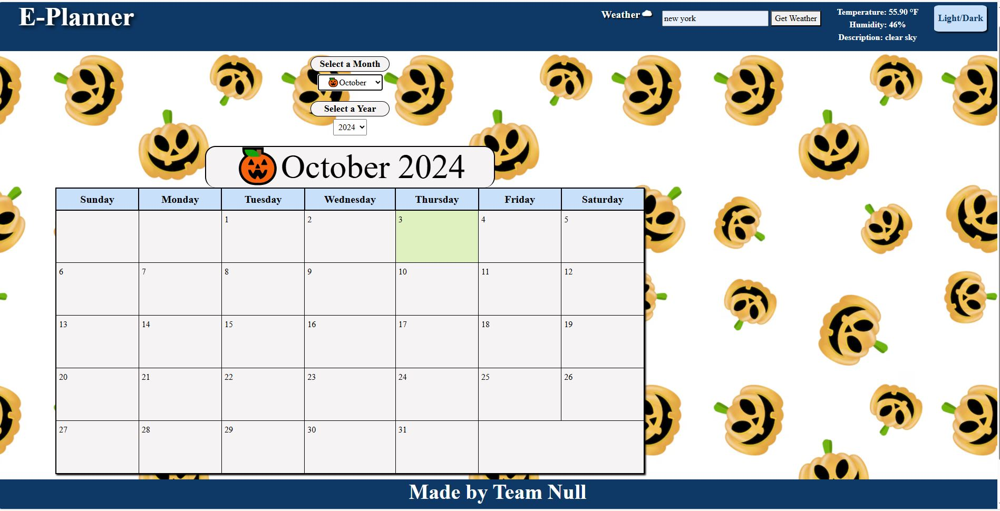
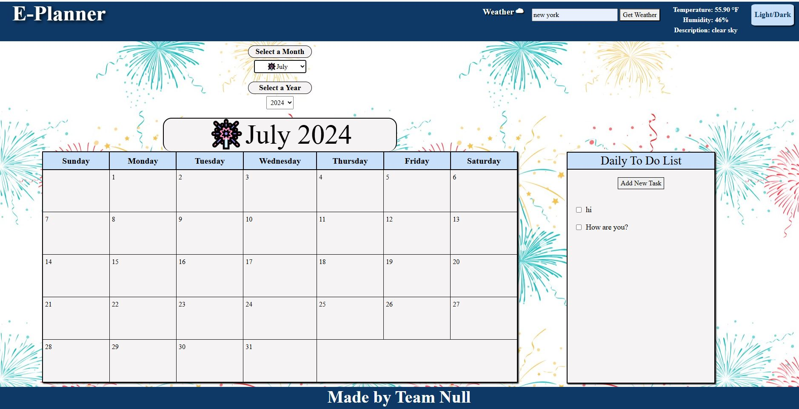
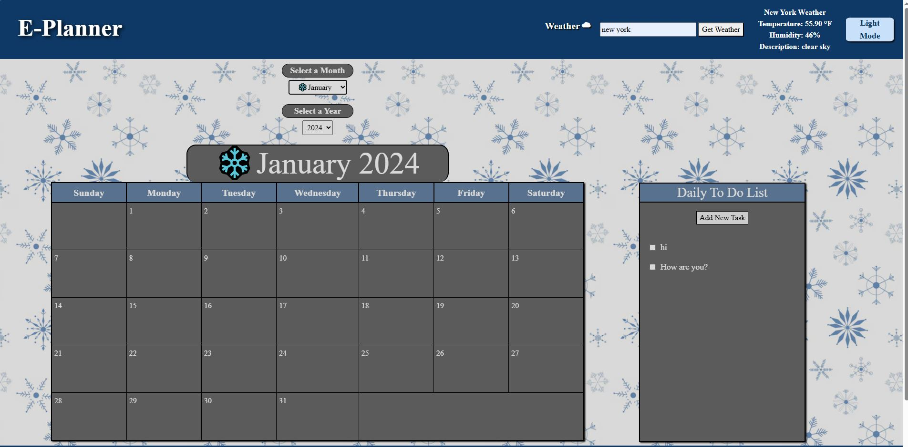

Professional ReadMe
# <To do list calendar>

## Description

Our team work togeher to develop the front end project website consist of a calendar, to do list and weather forcast station. Our team works together to brainstorm the idea through sketchboard and research. We work on the coding together through the VSO live sharing. 

 * Project Github Page: https://ejmaller7.github.io/Project-1/
 * Project Github Repo: https://github.com/ejmaller7/Project-1

## Installation

What are the steps required to install your project? Provide a step-by-step description of how to get the development environment running.
    We included the bootrap css 
    we also use the Visual studio live sharing for everyone to work on.

## Usage

Provide instructions and examples for use. Include screenshots as needed.

    
    
    
    

## Credits
 * Ethan Maller  https://github.com/ejmaller7
 * Brian Solano https://github.com/brolano
 * Christopher Fortier  https://github.com/ChrisFort03
 * Justin Miller  https://github.com/JPMill
 * Hon chau  https://github.com/kevinchau7

List your collaborators, if any, with links to their GitHub profiles.

If you used any third-party assets that require attribution, list the creators with links to their primary web presence in this section.

If you followed tutorials, include links to those here as well.

## License

MIT License

## Features

If your project has a lot of features, list them here.
1. calendar 
2. To-do list function will let user to input task for each day. When the tasks are completed, the calenday day will change color to reflect the action. 
3. Weather hyperlink will direct you to the weather website. 

## Tests

Go the extra mile and write tests for your application. Then provide examples on how to run them here.